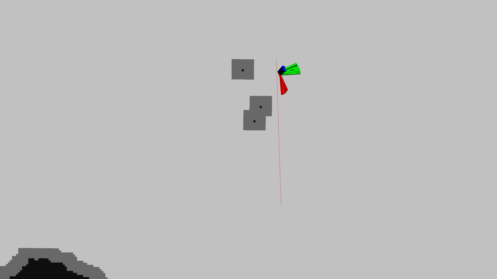
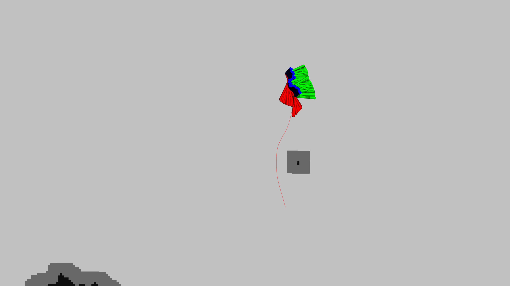
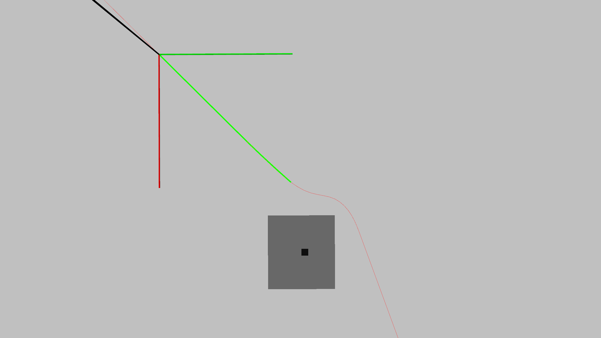
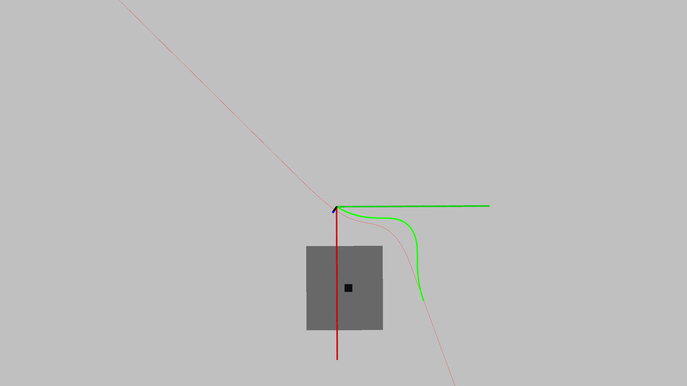
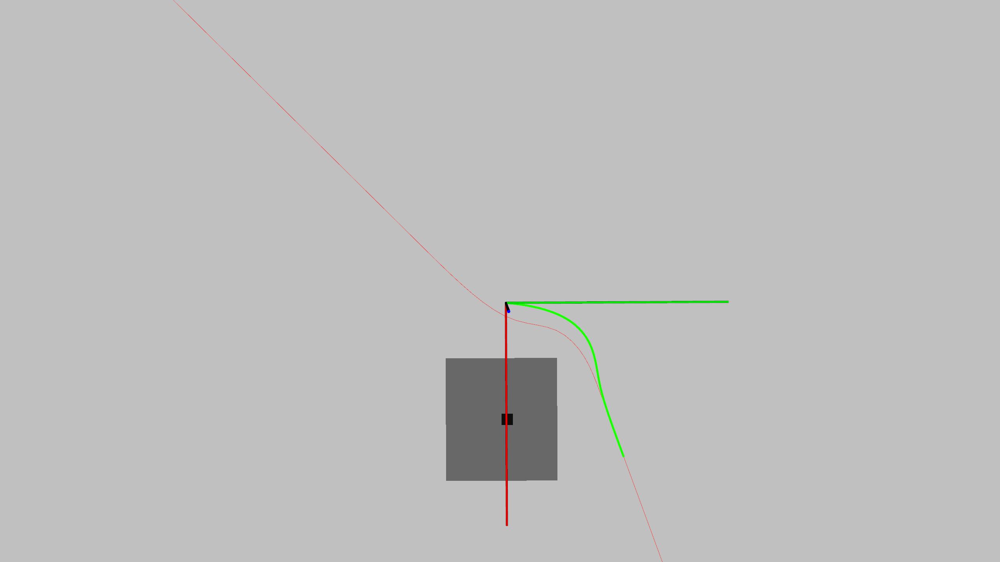
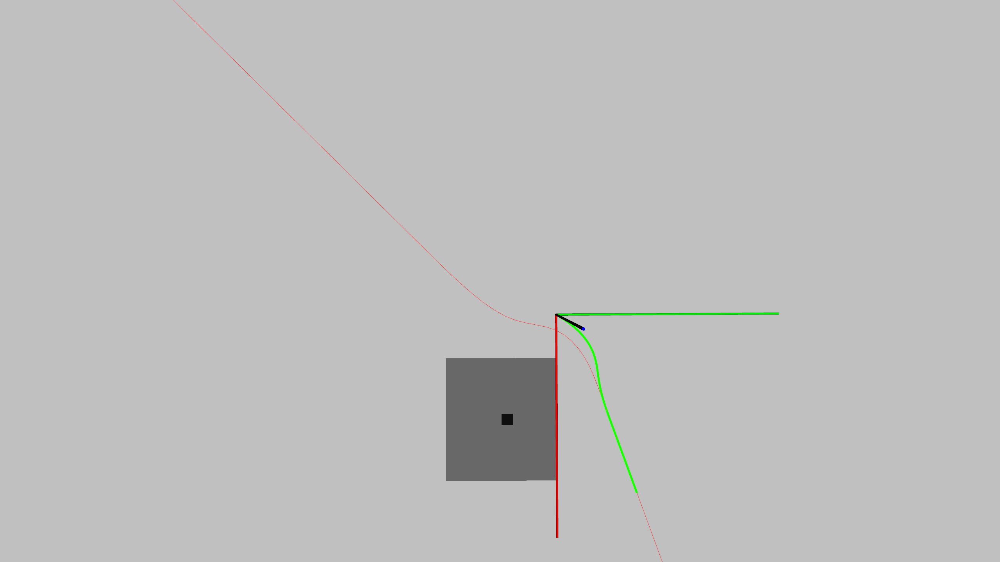
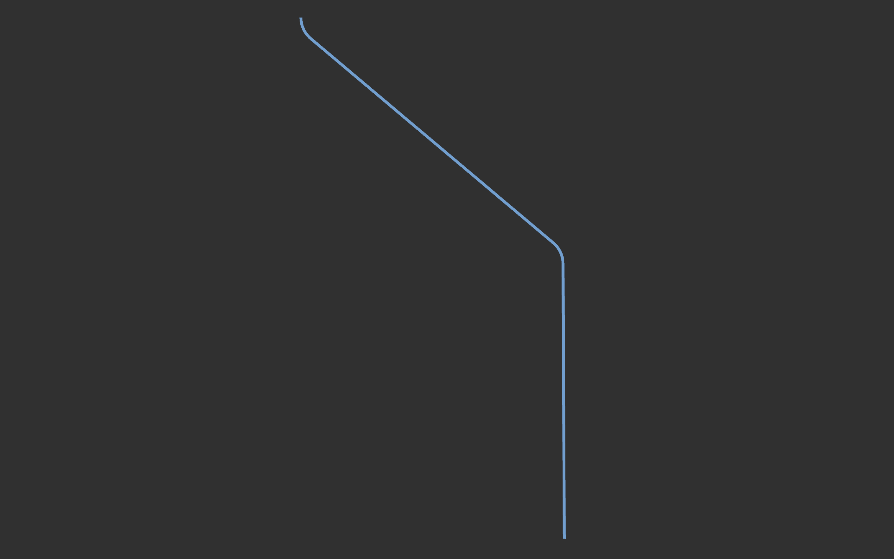
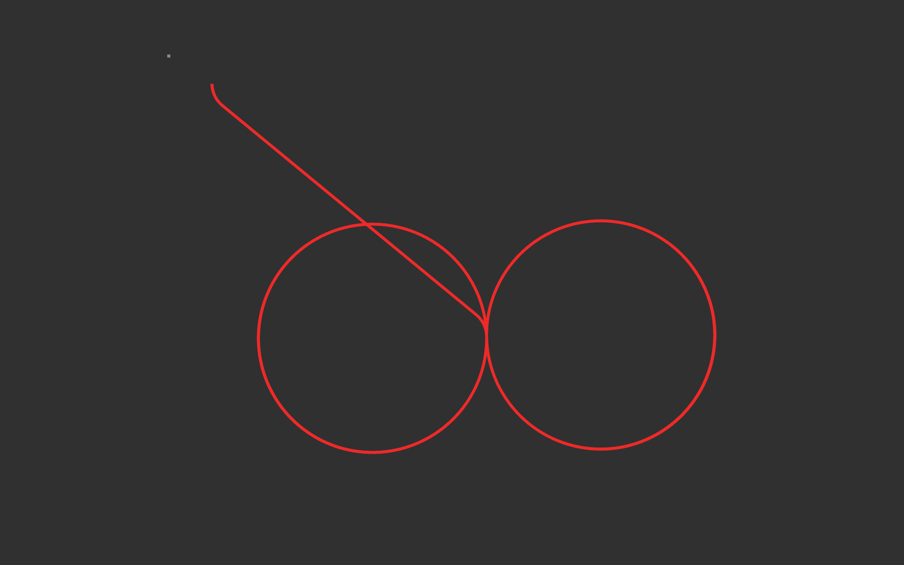

# path-planning-for-lq-program
ros package for path planning and map_fusion which were used in lq program.
## 运行环境

<p align="center">
    
    
</p>

## Quike Start

1.
```shell
git clone https://github.com/hehehhh/path-planning-for-lq-program.git
```

2.
```shell
cd path-path-planning-for-lq-program
catkin_make
souce ./devel/setup.bash
```

```shell
roslaunch lq_yg_map_server test_map_fusion_server.launch
```

## Document
#### LQ rosnode
```shell
source ./devel/setup.bash
roslaunch lq_yg_map_server map_fusion_server.launch 
```
<p align="center">
  
</p>

<p align="center">
  
</p>

<p align="center">
  
</p>

<p align="center">
  
</p>

<p align="center">
  
</p>

<p align="center">
  
</p>

#### a local planner using b-spline curve search
```shell
source ./devel/setup.bash
roslaunch lq_yg_map_server test_map_fusion_server.launch
rosrun path_search bspline_local_planner_node 
```
<p align="center">
  
  
  
  
  
</p>

#### Standard path with Dubins curve
```shell
rosrun standard_path standard_path_test
```
##### line path with Dubins curve
<p align="center">
  
</p>
##### circle path with Dubins curve
<p align="center">
  
</p>
##### line path with Dubins curve
<p align="center">
  
</p>


